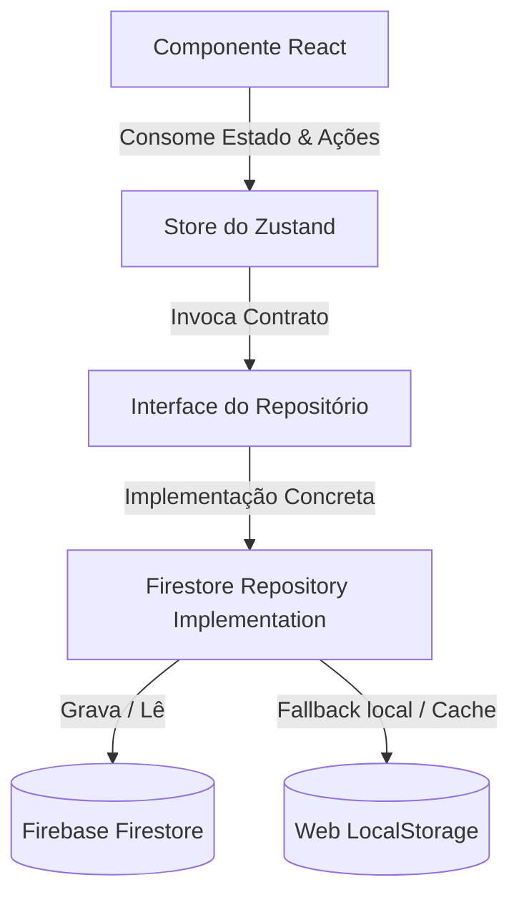

# Relatório da Camada de Repositório — Repository Layer (Sprint 03)

Este documento detalha o processo de criação e implantação da camada de repositórios no projeto Gestão de Obras. A refatoração eliminou a dependência direta dos componentes React e das stores Zustand do Firebase SDK / Firestore, encapsulando toda a persistência de dados em classes utilitárias isoladas.

## 1. Diagrama de Arquitetura

O fluxo de dados do sistema foi alinhado ao padrão da arquitetura em camadas abaixo:

Dessa forma:
1. A **UI (Componentes)** desconhece a origem ou a forma de persistência dos dados.
2. As **Stores (Zustand)** gerenciam o fluxo lógico de negócio chamando a interface neutra do repositório.
3. A **Infraestrutura (Firestore/LocalStorage)** fica restrita às classes de repositório sob `src/repositories/`.

---

## 2. Estrutura Criada (`src/repositories/`)

Foram estabelecidos 4 contratos de repositórios e suas respectivas implementações concretas:

### Contratos (Interfaces)
- **[ProjectRepository.ts](file:///c:/Users/Antonio%20Augusto/OneDrive%20-%20DR%20Construtora%20e%20Servi%C3%A7os%20Ltda/%C3%81rea%20de%20Trabalho/Projetos%20e%20An%C3%A1lises/Portal%20Gerenciador/module_Obras/src/repositories/ProjectRepository.ts):** Contrato para controle de obras (`getAll`, `getById`, `save`, `update`, `delete`).
- **[TeamRepository.ts](file:///c:/Users/Antonio%20Augusto/OneDrive%20-%20DR%20Construtora%20e%20Servi%C3%A7os%20Ltda/%C3%81rea%20de%20Trabalho/Projetos%20e%20An%C3%A1lises/Portal%20Gerenciador/module_Obras/src/repositories/TeamRepository.ts):** Contrato para controle de turmas/equipes.
- **[RDORepository.ts](file:///c:/Users/Antonio%20Augusto/OneDrive%20-%20DR%20Construtora%20e%20Servi%C3%A7os%20Ltda/%C3%81rea%20de%20Trabalho/Projetos%20e%20An%C3%A1lises/Portal%20Gerenciador/module_Obras/src/repositories/RDORepository.ts):** Contrato para controle de Diários de Obras (Rdos).
- **[ContractRepository.ts](file:///c:/Users/Antonio%20Augusto/OneDrive%20-%20DR%20Construtora%20e%20Servi%C3%A7os%20Ltda/%C3%81rea%20de%20Trabalho/Projetos%20e%20An%C3%A1lises/Portal%20Gerenciador/module_Obras/src/repositories/ContractRepository.ts):** Contrato para controle de aditivos e dados financeiros do contrato.

### Implementações Firestore
- **[FirestoreProjectRepository.ts](file:///c:/Users/Antonio%20Augusto/OneDrive%20-%20DR%20Construtora%20e%20Servi%C3%A7os%20Ltda/%C3%81rea%20de%20Trabalho/Projetos%20e%20An%C3%A1lises/Portal%20Gerenciador/module_Obras/src/repositories/FirestoreProjectRepository.ts):** Interage com a coleção `construction_projects`.
- **[FirestoreTeamRepository.ts](file:///c:/Users/Antonio%20Augusto/OneDrive%20-%20DR%20Construtora%20e%20Servi%C3%A7os%20Ltda/%C3%81rea%20de%20Trabalho/Projetos%20e%20An%C3%A1lises/Portal%20Gerenciador/module_Obras/src/repositories/FirestoreTeamRepository.ts):** Interage com a coleção `construction_teams`.
- **[FirestoreRDORepository.ts](file:///c:/Users/Antonio%20Augusto/OneDrive%20-%20DR%20Construtora%20e%20Servi%C3%A7os%20Ltda/%C3%81rea%20de%20Trabalho/Projetos%20e%20An%C3%A1lises/Portal%20Gerenciador/module_Obras/src/repositories/FirestoreRDORepository.ts):** Interage com a coleção `construction_rdos`.
- **[FirestoreContractRepository.ts](file:///c:/Users/Antonio%20Augusto/OneDrive%20-%20DR%20Construtora%20e%20Servi%C3%A7os%20Ltda/%C3%81rea%20de%20Trabalho/Projetos%20e%20An%C3%A1lises/Portal%20Gerenciador/module_Obras/src/repositories/FirestoreContractRepository.ts):** Sincroniza dados na nova coleção do Firestore `construction_contracts` aplicando dual-write e fallback transparente síncrono com o `localStorage` (garantindo persistência off-line e sem quebras no fluxo legado de contratos).

---

## 3. Stores Migradas e Refatoradas (`src/stores/`)

Todas as stores globais foram atualizadas para consumir a camada de repositório ao invés de invocar serviços ou SDKs diretamente:

1. **[projectStore.ts](file:///c:/Users/Antonio%20Augusto/OneDrive%20-%20DR%20Construtora%20e%20Servi%C3%A7os%20Ltda/%C3%81rea%20de%20Trabalho/Projetos%20e%20An%C3%A1lises/Portal%20Gerenciador/module_Obras/src/stores/projectStore.ts):** Instancia `FirestoreProjectRepository`.
2. **[teamStore.ts](file:///c:/Users/Antonio%20Augusto/OneDrive%20-%20DR%20Construtora%20e%20Servi%C3%A7os%20Ltda/%C3%81rea%20de%20Trabalho/Projetos%20e%20An%C3%A1lises/Portal%20Gerenciador/module_Obras/src/stores/teamStore.ts):** Instancia `FirestoreTeamRepository`.
3. **[rdoStore.ts](file:///c:/Users/Antonio%20Augusto/OneDrive%20-%20DR%20Construtora%20e%20Servi%C3%A7os%20Ltda/%C3%81rea%20de%20Trabalho/Projetos%20e%20An%C3%A1lises/Portal%20Gerenciador/module_Obras/src/stores/rdoStore.ts):** Instancia `FirestoreRDORepository`.
4. **[planningStore.ts](file:///c:/Users/Antonio%20Augusto/OneDrive%20-%20DR%20Construtora%20e%20Servi%C3%A7os%20Ltda/%C3%81rea%20de%20Trabalho/Projetos%20e%20An%C3%A1lises/Portal%20Gerenciador/module_Obras/src/stores/planningStore.ts):** Instancia `FirestoreContractRepository`. As ações de carregar planejamento (`loadPlanningData`) e gravação (`saveContractData`) foram tornadas assíncronas para aguardar o Firestore de forma transparente.

---

## 4. Benefícios Arquiteturais Obtidos

- **Desacoplamento de Infraestrutura (Clean Architecture):** Caso a DR Construtora decida substituir o Firestore por outro banco de dados (ex: MongoDB, PostgreSQL, SQL Server ou API REST externa), basta criar uma nova implementação que atenda às interfaces de repositório e injetá-las nas stores, sem tocar nas views React ou nas stores de estado do Zustand.
- **Segurança de Tipos (TypeScript):** As interfaces garantem que as stores usem somente métodos assinados e validados em tempo de compilação, prevenindo queries incorretas no Firestore.
- **Centralização de Cache e Sincronização:** O padrão dual-write implementado no `FirestoreContractRepository` simplificou o fluxo, eliminando código duplicado de cacheamento que anteriormente poluía a store ou os componentes.
- **Testabilidade:** Agora é simples escrever testes de unidade e integração mockando as interfaces dos repositórios (`ProjectRepository`, etc.) sem necessitar de conexões com o Firebase Emulator ou bancos reais em produção.

---

## 5. Validação Técnica

- **Typecheck estático (`npm run lint`):** A execução do comando `tsc --noEmit` reportou zero erros em todo o escopo do projeto.
- **Compilação de Produção (`npm run build`):** O bundle do Vite buildou com sucesso, empacotando os novos repositórios e módulos sem warnings de runtime ou compilação.
